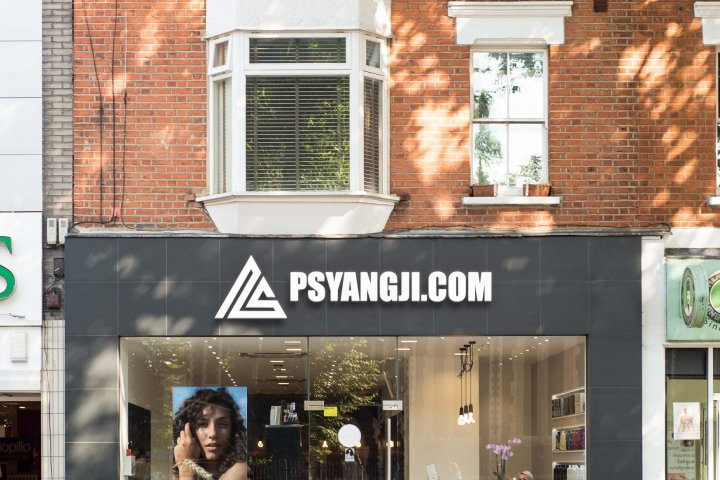
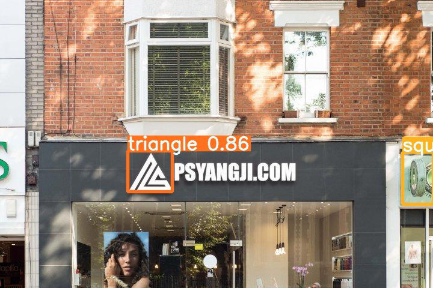

# Theme color extraction

Regarding the RGB pixels in the image as 3-dimensional data points, we can do a color clustering to perform the theme color extraction.

## API

This directory consists of the following APIs.

### box_theme_color.py

provide two APIs

* get_theme_color()

  receive an image, the box in form of xyxy, and number of clusters

  return the theme colors, and their corresponding percentage

* visualize_theme_color()

  receive the output of get_theme_color()

  visualize the theme colors

We can extend the get_theme_color() to get the theme colors from text box and logo box. Then compute their relevance.

### ocr_theme_color.py

extension of box_theme_color, provide theme color extraction API for PaddleOCR box

### logo_theme_color.py

extension of box_theme_color, provide theme color extraction API for YOLO box

## Example

### Input Image

As always, we use the following image as example to illustrate the functionality of our system

### Text Theme Color

The PaddleOCR recognizes the text region, and we use API in ocr_theme_color.py to extract the corresponding theme color

which yields

### Logo Theme Color

The yolo model detects the logo region, 

Using API in logo_theme_color.py, we can extract its theme colors

Then, we can try to design matching algorithm to compute their similarity, which provides a ranking metric for relevant logo selection.

## TODO

* design theme color matching algorithm

## Reference

1. https://www.pyimagesearch.com/2014/05/26/opencv-python-k-means-color-clustering/